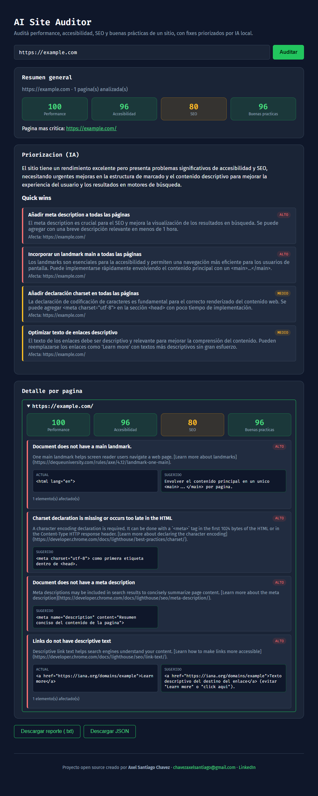

# AI Site Auditor

Audita un sitio web (performance, accesibilidad, SEO, buenas prácticas) y usa
IA local (sin costo, sin API paga) para traducir el resultado crudo en un
reporte priorizado y explicado.



Ver [docs/SPEC.md](docs/SPEC.md) para el detalle de qué ofrece el reporte,
el alcance de la v1, cómo se manejan las páginas con login, y por qué la
IA corre local en vez de contra una API paga.

## Estructura

- `server/` — API en Node/Express. Endpoint `POST /audit` (y `GET /audit/stream`
  con progreso en vivo via SSE) recibe una URL, crawlea el sitio (homepage +
  hasta 5 links internos), corre Lighthouse por página y prioriza los fixes
  con un modelo local via Ollama.
- `client/` — Frontend en React + Vite + TypeScript.

## Requisitos

- **Node.js 20 o superior** ([nodejs.org](https://nodejs.org)).
- **Google Chrome** instalado (Lighthouse lo usa para auditar cada página).
- **[Ollama](https://ollama.com)** instalado — es lo que corre la capa de IA
  local, sin costo ni API key.

## Instalación

1. Cloná el repo:
   ```bash
   git clone https://github.com/SSJAxel/ai-site-auditor.git
   cd ai-site-auditor
   ```

2. Instalá las dependencias del backend y del frontend:
   ```bash
   cd server && npm install
   cd ../client && npm install
   ```

3. Instalá Ollama (si no lo tenés ya) y bajá el modelo que usa el proyecto:
   ```bash
   ollama pull qwen2.5:7b
   ```
   Dejá Ollama corriendo en segundo plano (se inicia solo tras instalarlo, o
   corré `ollama serve` manualmente).

4. Corré backend y frontend, cada uno en su propia terminal:
   ```bash
   # terminal 1
   cd server
   npm run dev   # http://localhost:4000

   # terminal 2
   cd client
   npm run dev   # http://localhost:5173
   ```

5. Abrí [http://localhost:5173](http://localhost:5173), poné una URL y
   apretá "Auditar". La primera corrida puede tardar 1-2 minutos (Lighthouse
   + el modelo de IA corriendo en CPU) — es esperable, no está colgado.

### Variables de entorno opcionales (`server/`)

| Variable | Default | Para qué sirve |
| --- | --- | --- |
| `PORT` | `4000` | Puerto del backend |
| `OLLAMA_BASE_URL` | `http://localhost:11434` | Si Ollama corre en otra máquina/puerto |
| `OLLAMA_MODEL` | `qwen2.5:7b` | Cambiar de modelo (ej. `llama3.2:3b` para respuestas más rápidas) |

## Estado actual

Funcional de punta a punta: crawler con detección de login wall, audit
real con Lighthouse (scores + issues + snippet actual/sugerido), capa de
priorización con IA local (Ollama) con progreso en vivo, frontend que
visualiza todo el reporte, y exportables en `.txt` y `.json`. Pendiente:
hosting público (si se decide publicarlo, con límite de uso diario para no
depender de recursos ilimitados de una sola máquina).
